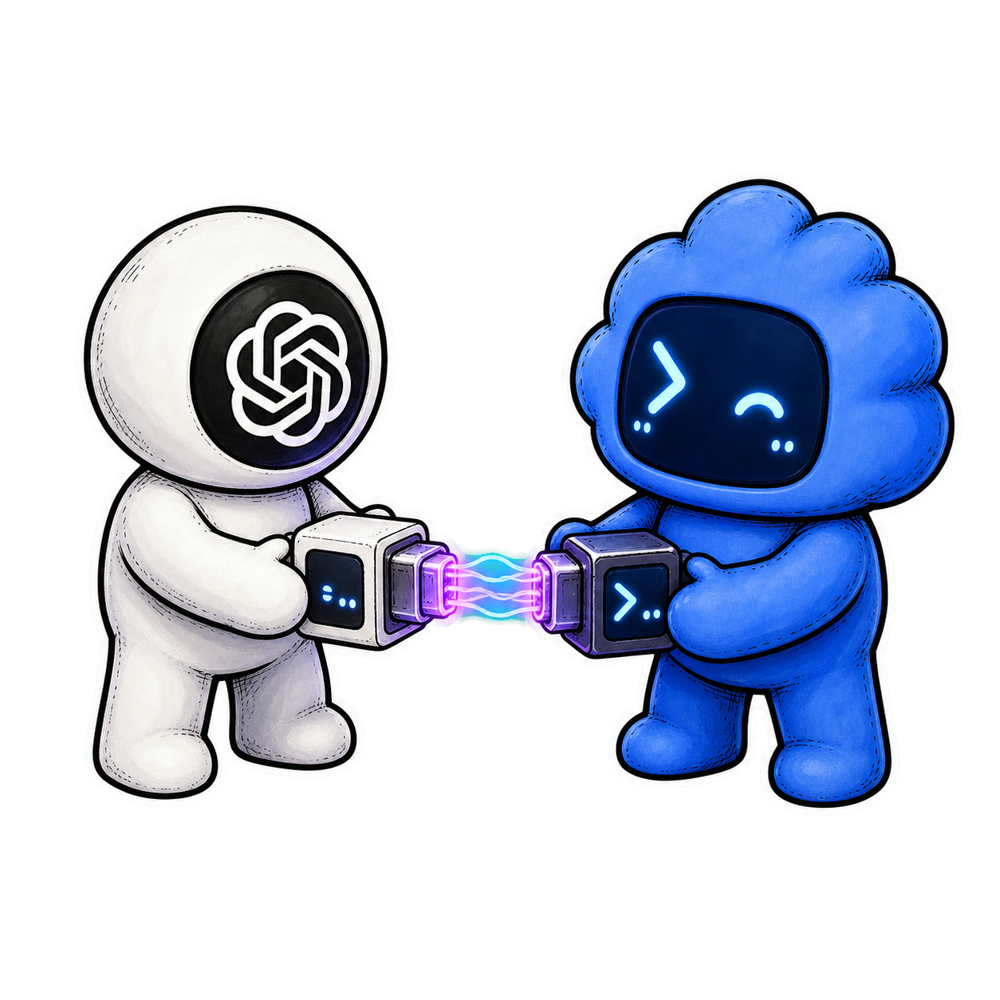
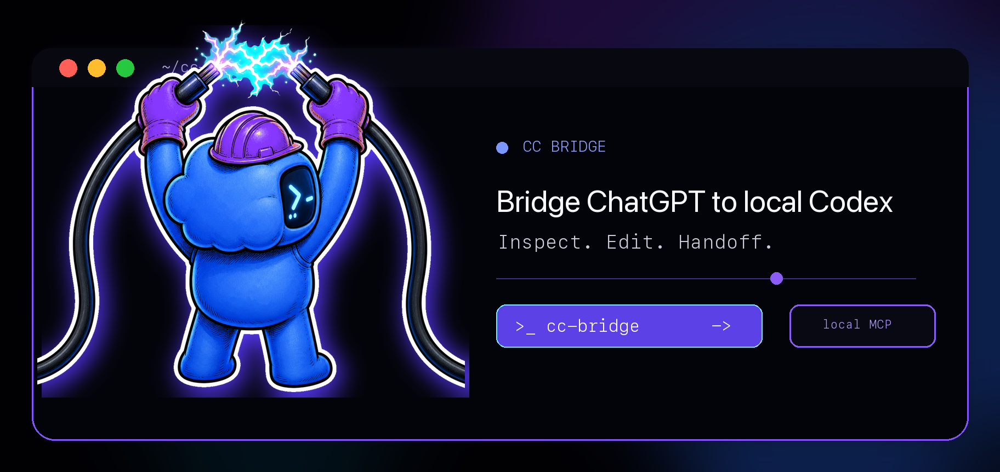

<p align="center">
  
</p>

<h1 align="center">cc-bridge</h1>

<p align="center">
  <em>ChatGPT Developer Mode를 로컬 저장소와 연결하고, Codex 실행은 터미널에 맡기는 브리지.</em>
</p>

<p align="center">
  
  
  <a href="./package.json">= 1.3"></a>
  <a href="./package.json">= 20"></a>
</p>

<p align="center">
  <sub><a href="./README.md">English</a> &middot; <a href="./README.ko.md">한국어</a></sub>
</p>

---

<p align="center">
  
</p>

`cc-bridge`는 ChatGPT Developer Mode가 하나의 로컬 저장소 안에서 작업할 수
있게 해주는 TypeScript CLI 및 HTTP MCP 서버입니다. ChatGPT는 읽기, 검색,
수정, 테스트, 생성 이미지 저장, Codex 핸드오프 계획 작성 도구를 제한된
범위에서 사용할 수 있습니다. Codex 실행은 로컬에 남습니다. 사용자의
터미널에서 `execute-handoff` 또는 `watch-handoff`를 실행해야 합니다.

> `cc-bridge`는 ChatGPT Web 자동화 도구, 모델 프록시, 호스팅 서비스, OS
> 샌드박스가 아닙니다. 선택된 로컬 저장소 도구를 MCP로 노출하는 개발
> 도구입니다. 연결된 MCP 클라이언트는 해당 작업공간에 접근 권한을 가진,
> 신뢰할 수 있는 코딩 파트너로 취급해야 합니다.

**터널 모드는 항상 토큰 인증이 필요합니다. 파일 작업은 realpath로 확인한
하나의 작업공간 루트 안에 갇힙니다. 읽기는 시크릿처럼 보이는 값을
마스킹하고, 쓰기와 수정은 시크릿처럼 보이는 리터럴을 거부합니다. `bash`
도구는 검증 명령과 제한된 git 조회만 허용합니다. 원격 MCP 도구는 Codex를
직접 실행하지 않습니다.**

## 왜 필요한가요?

ChatGPT Developer Mode는 코드를 잘 추론할 수 있지만 실제 체크아웃을
안전하게 읽고 수정하려면 로컬 도구가 필요합니다. Codex는 터미널에서 도는 실행
루프에 강하지만, 웹 ChatGPT 세션이 로컬 에이전트를 직접 실행해서는 안
됩니다.

`cc-bridge`는 이 경계를 분명히 둡니다:

- ChatGPT는 작은 MCP 도구 표면에서 작업합니다.
- 로컬 파일은 하나의 설정된 작업공간 루트 아래에 머뭅니다.
- ChatGPT는 브리지의 현재 핸드오프 계획을 작성할 수 있습니다.
- Codex가 그 계획을 언제 실행할지는 사용자의 터미널이 결정합니다.

## MCP 도구

| 도구 | 목적 | 비고 |
|---|---|---|
| `server_config` | 루트, 터널/인증 모드, 제한값, 차단 glob 표시 | 첫 진단에 유용 |
| `open_workspace` | 단일 작업공간, `AGENTS.md`, 스킬, git 상태, 선택적 트리 로드 | 세션 시작 시 한 번 호출 |
| `tree` | 제한된 작업공간 트리 반환 | 차단 경로는 건너뜀 |
| `search` | 작업공간 안 텍스트 검색 | 결과는 제한되고 마스킹됨 |
| `read` | 줄 번호와 함께 텍스트 읽기 | 시크릿처럼 보이는 값은 마스킹 |
| `write` | 새 파일 생성, `overwrite:true`일 때만 덮어쓰기 | 시크릿처럼 보이는 리터럴 거부 |
| `edit` | 정확한 텍스트 치환 | 소스 수정에 권장 |
| `bash` | 허용된 검증/git 명령 실행 | 파이프, 리다이렉션, 네트워크, publish, 파괴적 명령 금지 |
| `git_status` | `git status --porcelain=v1` 반환 | 전용 git 검토 도구 |
| `git_diff` | 제한된 `git diff` 출력 반환 | 선택된 diff 플래그만 허용 |
| `show_changes` | 상태와 diff stat 반환 | 수정 후 호출 |
| `load_skill` | 발견된 `SKILL.md` 로드 | 발견된 스킬 범위 안에서만 |
| `save_image_artifact` | base64 이미지 데이터를 작업공간에 저장 | MIME 검사, 기본 위치 `assets/generated/` |
| `render_save_image_widget` | 이미지 저장용 대체 위젯 반환 | ChatGPT Apps 호환 호스트용 |
| `handoff_to_codex` | 현재 Codex 핸드오프 계획 작성 | Codex 실행 안 함 |
| `read_handoff` | 브리지 계획/상태/diff/로그 읽기 | 시크릿처럼 보이는 값 마스킹 |

## CLI

의존성을 설치하고 TypeScript를 빌드한 뒤 필요하면 바이너리를 연결합니다.

```bash
bun install
bun run build
bun link
```

인증 없이 로컬 개발 서버 시작:

```bash
cc-bridge start --no-auth
```

토큰 인증으로 시작:

```bash
cc-bridge start --token "$(node -e "console.log(crypto.randomUUID())")"
```

공개 터널로 시작:

```bash
cc-bridge start --tunnel cloudflare
cc-bridge start --tunnel ngrok --ngrok-hostname your-domain.ngrok.app
```

터널 모드는 `?cc_bridge_token=...`이 포함된 MCP URL을 출력합니다. 이 URL을
ChatGPT Developer Mode / Create Apps의 Streamable HTTP MCP 서버에 붙여
넣습니다. 쿼리 토큰은 시크릿이므로 URL을 공개하지 마세요.

핸드오프 dry-run:

```bash
cc-bridge execute-handoff --dry-run
```

현재 핸드오프 계획을 로컬에서 실행:

```bash
cc-bridge execute-handoff --yes
```

새 계획을 감시하고 실행:

```bash
cc-bridge watch-handoff --yes
```

옵션:

```text
start:
  --root <path>                 작업공간 루트, 기본값 cwd
  --port <n>                    HTTP 포트, 기본값 8787
  --host <host>                 바인드 호스트, 기본값 127.0.0.1
  --token <token>               인증 토큰, 기본값 임의 UUID
  --tunnel <mode>               none, cloudflare, ngrok
  --ngrok-hostname <host>       고정 ngrok 도메인
  --no-auth                     토큰 인증 비활성화, 로컬 전용
  --include-plugin-skills       플러그인 캐시 스킬 포함

execute-handoff / watch-handoff:
  --root <path>                 작업공간 루트
  --agent <name>                에이전트 라벨, 기본값 codex
  --model <model>               핸드오프 모델 override
  --reasoning-effort <level>    low, medium, high
  --command <cmd>               테스트용 에이전트 명령 override
  --dry-run                     실행하지 않고 명령만 출력
  --yes                         확인 생략
  --once                        watch-handoff 전용: 한 번 실행 후 종료
```

## HTTP MCP 서버

서버는 기본적으로 `127.0.0.1:8787`에 바인드됩니다. 인증 모드에서는 Bearer
토큰 또는 `cc_bridge_token` 쿼리 파라미터를 받습니다.

MCP 도구 목록 조회:

```bash
curl -s -X POST http://127.0.0.1:8787/mcp \
  -H "Content-Type: application/json" \
  -H "Accept: application/json, text/event-stream" \
  -d '{"jsonrpc":"2.0","id":1,"method":"tools/list"}'
```

헬스 체크:

```bash
curl -s http://127.0.0.1:8787/health
```

엔드포인트:

- `POST /mcp`
- `GET /health`
- `GET /`

환경 변수:

| 변수 | 기본값 | 설명 |
|---|---|---|
| `CC_BRIDGE_ROOT` | cwd | 작업공간 루트 |
| `CC_BRIDGE_PORT` | `8787` | 수신 포트 |
| `CC_BRIDGE_HOST` | `127.0.0.1` | 바인드 호스트 |
| `CC_BRIDGE_TOKEN` | 임의 UUID | MCP 인증 토큰 |
| `CC_BRIDGE_TUNNEL` | `none` | `none`, `cloudflare`, `ngrok` |
| `CC_BRIDGE_NGROK_HOSTNAME` | 미설정 | 고정 ngrok 도메인 |
| `CC_BRIDGE_HANDOFF_MODEL` | `gpt-5.4-mini` | 기본 Codex 핸드오프 모델 |
| `CC_BRIDGE_HANDOFF_REASONING` | `medium` | `low`, `medium`, `high` |
| `CC_BRIDGE_HANDOFF_COMMAND` | 미설정 | 로컬 에이전트 명령 override |
| `CC_BRIDGE_INCLUDE_PLUGIN_SKILLS` | 미설정 | 설정 시 플러그인 캐시 스킬 포함 |

에러는 엔드포인트에 따라 MCP 도구 에러 또는 HTTP JSON/text 에러로
반환됩니다. 인증 없는 `/mcp` 요청은 401을 반환합니다.

## 핸드오프 구조

핸드오프 상태는 저장소 안의 브리지 컨텍스트 디렉토리에 저장됩니다.

```text
current-plan.md
agent-status.md
codex-status.md
implementation-diff.patch
execution-log.jsonl
decisions.md
open-questions.md
```

`handoff_to_codex`는 `current-plan.md`를 쓰고 JSONL 이벤트를 추가합니다.
`execute-handoff`와 `watch-handoff`는 그 계획을 읽고 사용자의 터미널에서만
로컬 명령을 실행한 뒤 상태 파일과 git diff 패치를 씁니다.

기본 실행:

```text
codex exec --model gpt-5.4-mini <plan_text>
```

`--dry-run`은 명령을 출력하고 dry-run 로그만 남깁니다. 비대화형 셸에서 실제
실행하려면 `--yes`가 필요합니다.

## 라이브러리 API

```js
import {
  createBridgeServer,
  resolveConfig,
  startListening
} from './dist/index.js';

const config = resolveConfig({ root: process.cwd(), noAuth: true });
const handle = createBridgeServer(config);

await startListening(handle, config);
console.log(handle.url());
```

<details>
<summary><strong>전체 내보내기 목록</strong></summary>

패키지는 CLI가 내부에서 사용하는 구성 요소를 함께 내보냅니다. 설정 헬퍼,
작업공간/경로 가드, 안전한 bash 검증, 스킬 발견, 이미지 저장, 핸드오프
실행, 위젯, 파일시스템 작업, MCP 도구 등록, 서버 헬퍼, 터널 런처 유틸리티가
포함됩니다. 전체 내보내기 목록은 `src/index.ts`를 확인하세요.

</details>

## 에이전트용 설치

일회성 설정:

```bash
cd /path/to/codex-chatgpt-bridge
bun install
bun run build
bun link
```

일반 로컬 흐름:

```bash
cc-bridge start --tunnel cloudflare
```

출력된 MCP URL을 ChatGPT Developer Mode에 연결합니다. 일반적인 에이전트
세션 흐름:

1. `open_workspace` 호출.
2. `tree`, `search`, `read`로 조사.
3. `edit` 또는 `write`로 수정.
4. `bash` 또는 전용 git 도구로 검증.
5. `show_changes` 호출.
6. 로컬 Codex 실행 계획이 필요할 때만 `handoff_to_codex` 사용.

## 보안

- 터널 모드는 `--no-auth`를 거부합니다.
- 인증은 Bearer 토큰 또는 `?cc_bridge_token=...`을 받습니다.
- 루트는 realpath로 확인되며 모든 파일 작업은 그 안에 머뭅니다.
- 차단 glob은 git 내부 파일, 환경 파일, 개인 키, SSH/AWS 자격 증명 폴더,
  의존성 폴더, 빌드 출력, 캐시, coverage, Codex 인증 파일을 포함합니다.
- 심볼릭 링크 탈출은 거부됩니다.
- 읽기는 시크릿처럼 보이는 값을 마스킹합니다.
- 쓰기와 수정은 시크릿처럼 보이는 리터럴을 거부합니다.
- `bash`는 셸 메타문자, 파이프, 리다이렉션, 네트워크 명령, publish 명령,
  파괴적 명령, 자동 수정 플래그, 절대 경로, 홈 경로, 상위 디렉토리 이동을
  차단합니다.
- `git_diff`는 셸 보간 없이 `git`을 실행하며 선택된 diff 플래그만 받습니다.
- 이미지 아티팩트는 MIME 검사, 크기 제한, 작업공간 제한을 적용합니다.
- 원격 MCP 도구는 Codex 계획을 쓸 수 있지만 Codex를 실행하지 않습니다.

## 테스트

```bash
bun run typecheck
bun run build
bun run test
```

테스트는 설정 파싱, 경로 제한, 차단 glob, 심볼릭 링크 탈출 거부, 시크릿
마스킹/탐지, 안전한 bash allowlist/blocklist, git diff 인자 안전성, 스킬
발견과 스킬 파일 범위, 이미지 MIME 검사와 저장 동작, 핸드오프 계획 해시와
실행/감시, HTTP MCP 스모크 흐름, 토큰 인증, 이미지 저장, URL 생성을
검증합니다.

## 릴리스

현재 패키지 버전: `v0.1.0`.

`v0.1.0`에는 TypeScript CLI, stateless HTTP MCP 서버, 단일 루트 작업공간
도구, 안전한 bash 정책, 이미지 아티팩트 저장, 로컬 전용 Codex 핸드오프
명령, 터널 헬퍼, 테스트 커버리지가 포함됩니다.

## 라이선스

MIT
