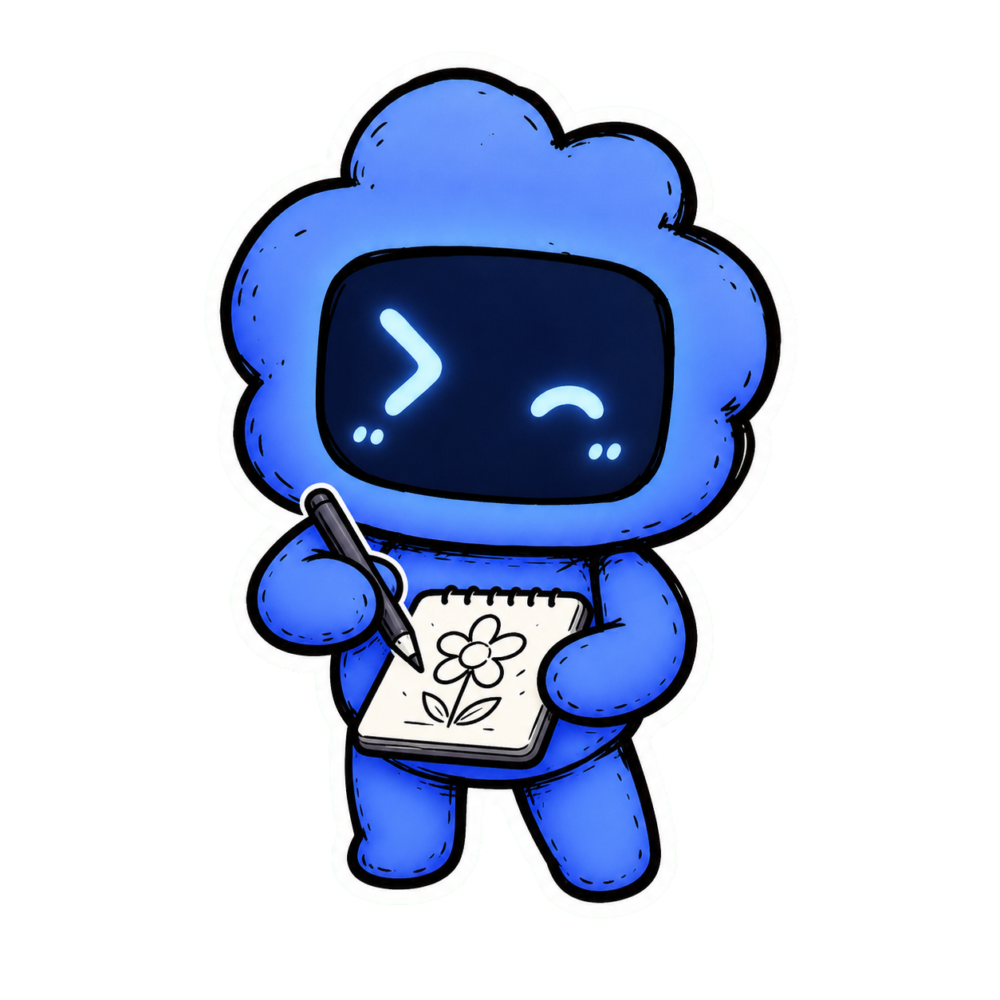
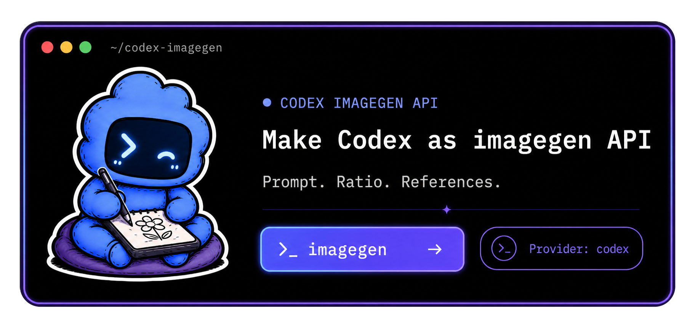

<p align="center">
  
</p>

<h1 align="center">imagegen-api</h1>

<p align="center">
  <em>Codex 이미지 생성을 네이티브 API, CLI, 로컬 HTTP 서버로.</em>
</p>

<p align="center">
  
  <a href="./LICENSE"></a>
  <a href="./package.json"></a>
</p>

<p align="center">
  <sub><a href="./README.md">English</a> &middot; <a href="./README.ko.md">한국어</a></sub>
</p>

---

<p align="center">
  
</p>

로컬 Codex ChatGPT 로그인을 사용해 빠르게 이미지를 생성하는 도구입니다.
같은 핵심 옵션 — `prompt`, `number`, `aspect_ratio`, `reference_file` — 이
CLI, 라이브러리 API, 로컬 HTTP 서버에서 모두 통합니다. 순수 Node.js 호환
런타임, 표준 라이브러리만 사용, 런타임 의존성 없이 `bun`으로 설치하고
실행합니다.

> 이 프로젝트는 `codex login`으로 저장된 토큰을 사용해 비공개 Codex 백엔드
> 경로를 호출합니다. 공식 OpenAI API가 아니며 사전 공지 없이 바뀔 수
> 있습니다. 이미지 생성은 사용자의 ChatGPT 플랜 사용량에 포함됩니다.

**`codex-cli` 프로바이더는 `--reference_file`과 `--size`를 조용히 무시하는
대신 즉시 실패합니다. `auto`는 사용자 의도가 사라질 수 있는 폴백을
거부합니다. 서버의 `reference_file`과 출력 루트는 샌드박스 안에 머뭅니다.
인증 토큰과 이미지 페이로드는 로그에 남기지 않습니다.**

## 왜 필요한가요?

에이전트 작업 중에는 화면을 옮기지 않고 바로 이미지 결과를 만들어야 할
때가 많습니다. 직접 Codex 백엔드를 호출하는 `codex` 경로는 빠르고
참조 이미지, 화면비, 다중 이미지 생성을 지원합니다. `codex-cli` 경로는 더
느리지만 private HTTP 경로가 실패할 때 대체 수단으로 쓸 수 있습니다.

## 프로바이더

| 프로바이더 | 전송 방식 | 참조 이미지 | 크기 | 다중 이미지 | 비고 |
|---|---|---|---|---|---|
| `codex` | Codex 백엔드 직접 HTTPS | 가능 (`-r`) | 가능 (`-a`) | 가능 (`-n`) | 기본값, 가장 빠른 경로 |
| `codex-cli` | `codex exec` 하위 프로세스 | 연결 안 됨 | 연결 안 됨 | 불가 | Codex CLI 자체는 `--image`를 지원하지만 이 프로바이더는 전달하지 않습니다. 참조와 크기는 프롬프트 텍스트로 적어주세요. |
| `auto` | private 먼저, CLI 폴백 | private 경로에서 가능 | private 경로에서 가능 | private 경로에서 가능 | `--` 플래그가 사라질 수 있으면 폴백 거부 |

`codex-cli` 프로바이더는 `codex exec`에 텍스트 프롬프트만 전달합니다.
Codex CLI 자체는 참조 이미지용 `--image, -i` 플래그를 지원하지만, 이
프로바이더는 그 플래그를 연결하지 않습니다 — `--reference_file`을 넘기면
`UNSUPPORTED_IMAGES`로 즉시 실패합니다. Codex CLI에는 크기 플래그가
없으므로 원하는 화면비는 프롬프트 텍스트에 적어 전달합니다(예: "16:9 가로
고양이 이미지"). 다중 이미지는 지원하지 않습니다(`codex exec` 한 번에
이미지 한 장).

`auto` 프로바이더는 `--reference_file`, `--aspect_ratio`/`--size`(auto
제외), `--number > 1` 중 하나라도 설정됐을 때 `codex-cli`로의 폴백을
거부합니다 — `codex-cli` 프로바이더가 그 구조화된 의도를 버리기
때문입니다:

- `SIZE_UNSUPPORTED_BY_FALLBACK`
- `IMAGES_UNSUPPORTED_BY_FALLBACK`
- `NUMBER_UNSUPPORTED_BY_FALLBACK`

## CLI

TypeScript를 빌드하고 로컬 바이너리를 한 번 연결합니다.

```bash
bun run build
bun link
```

먼저 인증을 확인합니다.

```bash
imagegen --auth
```

이미지 한 장 생성:

```bash
imagegen -p "한국인 남자가 카페 안 전신 거울 앞에서 셀카를 찍고 있는 사진" -o ./outputs/generate
```

16:9 비율로 두 장 생성:

```bash
imagegen -p "네온 불빛이 빛나는 사이버펑크 골목에서 손을 흔드는 친근한 로봇" -n 2 -a 16:9 -o ./outputs/generate
```

참조 이미지 사용:

```bash
imagegen -p "이 고양이에게 방울이 달린 니트 겨울 모자를 씌워줘" -r ./cat.png -o ./outputs/generate
```

백엔드를 호출하지 않고 요청 형태 확인:

```bash
imagegen -p "흰 배경 위 둥근 모서리의 평면적인 파란 사각형 아이콘, 미니멀" --dry-run
```

옵션:

```text
-p, --prompt <text>          필수 이미지 프롬프트
-n, --number <int>           이미지 수, 1부터 4까지
-a, --aspect_ratio <ratio>   1:1, 3:2, 2:3, 16:9, 9:16, 4:3, 3:4, auto 또는 원본 크기
-r, --reference_file <path>  참조 이미지 경로, 반복 가능
-o, --output-dir <dir>       출력 루트; 최종 디렉토리와 파일명은 자동 생성
-m, --model <name>           모델명
--provider <name>            codex, codex-cli, auto
--dry-run                    인증 확인 및 요청 형태 출력
--auth                       Codex ChatGPT 인증 상태 확인
```

<details>
<summary><strong>지원 원본 크기 &amp; 참조 형식</strong></summary>

지원하는 원본 크기: `1024x1024`, `1536x1024`, `1024x1536`, `2048x2048`,
`2048x1152`, `3840x2160`, `2160x3840`, `auto`. 참조 파일은
`png`, `jpg`, `jpeg`, `gif`, `webp` 중 하나여야 합니다. `--output-prefix`는
거부되며 파일명은 API가 생성합니다.

</details>

성공하면 CLI가 JSON을 출력합니다.

```json
{
  "provider": "codex",
  "count": 2,
  "images": [
    { "savedPath": "...", "relativePath": "...", "revisedPrompt": "...",
      "responseId": "...", "sessionId": "..." }
  ],
  "outputRoot": "...",
  "outputDir": "...",
  "relativeOutputDir": "...",
  "slug": "..."
}
```

## HTTP 서버

서버는 기본적으로 로컬에서만 열리며 Bearer 토큰이 필요합니다.

```bash
bun run build
export IMAGEGEN_API_TOKEN="$(node -e "console.log(require('crypto').randomBytes(24).toString('hex'))")"
bun start
```

HTTP로 이미지 생성:

```bash
curl -X POST http://127.0.0.1:8787/generate \
  -H "Authorization: Bearer $IMAGEGEN_API_TOKEN" \
  -H "Content-Type: application/json" \
  -d '{"prompt":"한국인 남자가 카페 안 전신 거울 앞에서 셀카를 찍고 있는 사진","aspect_ratio":"16:9","number":2}'
```

엔드포인트:

- `POST /generate`
- `GET /health`

`POST /generate`는 `prompt`, `number`, `aspect_ratio`, `reference_file`을
받습니다. `output_dir`과 `output_prefix`는 `OUTPUT_DIR_UNSUPPORTED` /
`OUTPUT_PREFIX_UNSUPPORTED`로 거부되며 출력 위치는 서버가 정합니다.

환경 변수:

| 변수 | 기본값 | 설명 |
|---|---|---|
| `IMAGEGEN_API_TOKEN` | 필수 | Bearer 토큰, 최소 16자 |
| `IMAGEGEN_PORT` | `8787` | 수신 포트 |
| `IMAGEGEN_HOST` | `127.0.0.1` | 바인드 호스트 |
| `IMAGEGEN_REFERENCE_ROOT` | 현재 디렉토리 | 참조 파일 샌드박스 루트 |
| `IMAGEGEN_OUTPUT_ROOT` | `<cwd>/outputs` | 생성 출력 루트 |
| `IMAGEGEN_MAX_BODY_BYTES` | `10485760` | 요청 본문 제한 |
| `IMAGEGEN_PROVIDER` | `codex` | 기본 프로바이더 |
| `IMAGEGEN_MODEL` | `gpt-5.4` | 모델명 |
| `CODEX_HOME` | `~/.codex` | Codex 설정 디렉토리 |

에러 응답은 JSON이며 `error`, `code`를 담고 생성 도중 실패한 경우에는
부분 결과 필드(`outputRoot`, `outputDir`, `relativeOutputDir`, `slug`,
`images`)까지 함께 내려옵니다. 상태 코드는 에러 코드에서 매핑됩니다.
`AUTH_EXPIRED` → 401, `RATE_LIMITED` → 429, 검증 에러 → 400,
`BODY_TOO_LARGE` → 413, 그 외에는 500.

## 출력 구조

생성 출력은 서버가 소유하며 CLI, HTTP, 라이브러리 세 표면에서 동일합니다.
실제 요청마다 새로운 불변 디렉토리가 만들어집니다.

```text
<output-root>/<local-yyyy-mm-dd>/<prompt-slug>/
<output-root>/<local-yyyy-mm-dd>/<prompt-slug>-2/
<output-root>/<local-yyyy-mm-dd>/<prompt-slug>-3/
```

`prompt-slug`는 프롬프트의 첫 15단어에서 가져와 소문자 ASCII로 만들고
지원하지 않는 문자는 `-`로 바꾼 뒤 연속된 구분자를 하나로 합치고 끝의
구분자를 잘라내 80자까지 제한합니다. ASCII 슬러그가 남지 않으면 `image`를
씁니다.

디렉토리 할당은 원자적으로 동작합니다. 기본 디렉토리부터 만들고 실패하면
`-2`, `-3` 순으로 최대 1,000번까지 시도합니다. 기존 파일은 절대 덮어쓰지
않습니다. 다중 이미지 생성은 순서대로 저장하며 뒤쪽 이미지가 실패해도 앞서
저장한 이미지는 그대로 둡니다(부분 결과로 반환).

요청 디렉토리 안의 파일명은 고정입니다.

```text
number = 1: image.png
number > 1: image-1.png, image-2.png, image-3.png, image-4.png
```

응답에는 절대 경로와 함께 출력 루트를 기준으로 한 POSIX 스타일 상대 경로가
들어갑니다. `--dry-run`은 디렉토리를 만들거나 예약하지 않고, 접미사 없는
계획 경로만 알려주며 실제 실행 시 숫자 접미사가 붙을 수 있다고 경고합니다.

## 라이브러리 API

```js
import { generateImage, resolveConfig } from './dist/index.js';

const config = resolveConfig();
const result = await generateImage({
  prompt: '한국인 남자가 카페 안 전신 거울 앞에서 셀카를 찍고 있는 사진',
  number: 2,
  aspect_ratio: '16:9',
  outputDir: './outputs/generate',
  config
});

console.log(result.images.map((image) => image.savedPath));
```

각 생성 요청에는 5분 타임아웃이 적용됩니다. 참조 파일은 base64 data URL로
읽혀 한 호출 안의 모든 N개 요청에 공유됩니다.

<details>
<summary><strong>전체 내보내기 목록</strong></summary>

패키지는 내부에서 쓰는 구성 요소도 함께 내보냅니다. `createProvider`
(`codex` / `codex-cli` / `auto`), `normalizeGenerationOptions`,
`normalizeNumber`, `normalizeReferenceFile`, `resolveAspectRatio`,
`ASPECT_RATIO_TO_SIZE`, `SUPPORTED_SIZES`, `buildRequest`, `createSseParser`,
`extractImage`, `readImageAsDataUrl`, 출력 헬퍼(`planOutputPaths`,
`allocateOutputPaths`, `slugFromPrompt`, `imageFilename`), 그리고 서버
유틸리티 `createHandler`, `sandboxReferencePath`, `sandboxOutputDir`,
`DEFAULT_MAX_BODY_BYTES`. 전체 내보내기 목록은 `src/index.ts`를
확인하세요.

</details>

## 에이전트 스킬

에이전트 스킬은 `.agents/skills/imagegen/`에 있습니다(기본 에이전트 설정
디렉토리). `.claude/skills/imagegen`은 같은 소스를 가리키는 심볼릭 링크라서
Claude Code 등 `.claude` 인식 도구에서도 중복 없이 사용할 수 있습니다.

```bash
.agents/skills/imagegen/scripts/imagegen-hook.sh -p "한국인 남자가 카페 안 전신 거울 앞에서 셀카를 찍고 있는 사진" -o ./outputs/generate
```

훅은 자신의 위치를 기준으로 저장소 루트를 찾기 때문에 셸 파이프라인이나
다른 도구에서 호출하기 쉽습니다.

## 에이전트용 설치

`imagegen` CLI를 설치하고 연결하는 일회성 설정:

```bash
cd /path/to/codex-imagegen-api
bun install
bun run build
bun link
imagegen --auth
```

설치 후에는 서버 없이 `imagegen`으로 바로 생성합니다:

```bash
imagegen -p "한국인 남자가 카페 안 전신 거울 앞에서 셀카를 찍고 있는 사진" -o ./outputs/generate
```

## 보안

- HTTP 서버는 `IMAGEGEN_API_TOKEN` 없이는 시작하지 않습니다.
- 서버는 기본적으로 `127.0.0.1`에 바인드됩니다.
- `reference_file`은 `IMAGEGEN_REFERENCE_ROOT` 안에 제한됩니다.
- 생성 출력은 `IMAGEGEN_OUTPUT_ROOT` 아래에 저장됩니다.
- 참조/출력 루트 모두 심볼릭 링크가 포함된 경로는 거부합니다.
- 요청 본문은 기본 10 MiB로 제한됩니다.
- 인증 토큰은 타이밍 누수를 막기 위해 상수 시간 비교로 검사합니다.
- 인증 토큰, 계정 id, 이미지 페이로드는 출력하지 않습니다.
- `codex-cli` 폴백은 생성 이미지 세션을 추측하지 않습니다.

## 테스트

```bash
bun test
```

설정 해석, 요청 빌드, SSE 파싱, 이미지 추출, 프로바이더 폴백(거부 케이스
포함), CLI 검증, 출력 경로 할당과 슬러그 생성, HTTP 인증, 경로 샌드박스,
본문 제한, 오류 응답 코드를 검증합니다.

## 릴리스

현재 태그: [`v0.0.1`](https://github.com/bytonylee/imagegen-api/releases/tag/v0.0.1)

`v0.0.1` 릴리스에는 CLI, 라이브러리 API, 로컬 HTTP 서버, 프로바이더 폴백
레이어, 원자적 할당을 갖춘 서버 소유 출력 구조, Devin 스킬 래퍼, 보안
샌드박스, 단위 테스트가 포함됩니다.

## 라이선스

MIT
