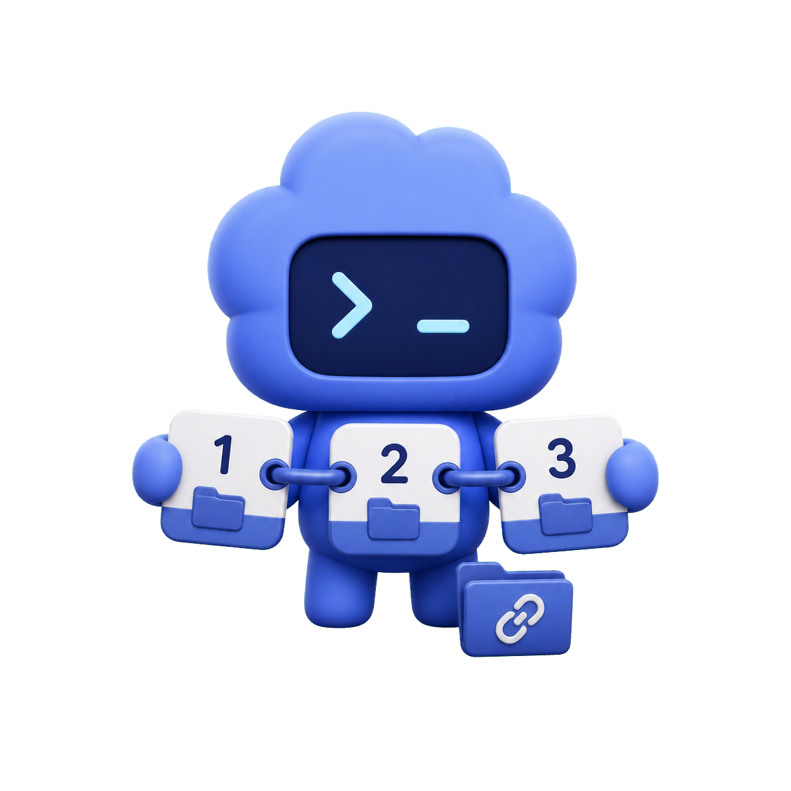
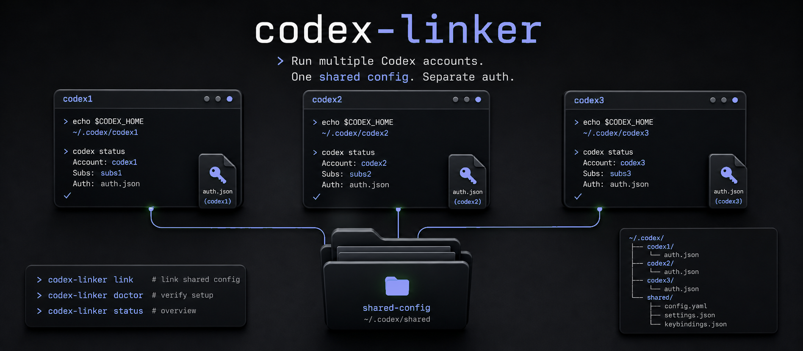

<p align="center">
  
</p>

<h1 align="center">codex-linker</h1>

<p align="center">
  <em>하나의 로컬 설정을 공유하면서 여러 Codex ChatGPT 계정을 전환합니다.</em>
</p>

<p align="center">
  
  <a href="./LICENSE"></a>
  <a href="./package.json"></a>
</p>

<p align="center">
  <sub><a href="./README.md">English</a> &middot; <a href="./README.ko.md">한국어</a></sub>
</p>

---

<p align="center">
  
</p>

여러 ChatGPT OAuth 계정을 같은 Mac에서 Codex CLI로 쉽게 바꿔 쓰기 위한
작은 링크 도구입니다. 계정마다 `auth.json`은 따로 두고, Codex 설정, MCP,
skills, hooks, sessions, history는 함께 씁니다.

`codex-linker`는 Codex 트래픽을 프록시하지 않습니다. 토큰을 파싱하거나,
OAuth를 갱신하거나, quota를 자동으로 라우팅하지도 않습니다.

## 요구사항

- Bun 1.3+
- Node.js 20+
- Codex CLI 설치 완료
- 첫 번째 Codex 계정이 이미 `~/.codex`에 로그인되어 있음

## 이 체크아웃에서 설치

```sh
bun install
bun run build
bun link
```

## 3개 계정 설정

1번 계정은 기본 Codex 홈을 그대로 씁니다.

```text
~/.codex
```

2번, 3번 계정용 홈을 만듭니다.

```sh
codex-linker setup --accounts 3
```

`setup`이 출력한 명령으로 추가 계정에 로그인합니다.

```sh
CODEX_HOME="$HOME/.codex-accounts/subs2" codex login
CODEX_HOME="$HOME/.codex-accounts/subs3" codex login
```

`~/.codex`의 공유 파일을 링크합니다.

```sh
codex-linker link subs2
codex-linker link subs3
```

사용 전에 상태를 확인합니다.

```sh
codex-linker doctor subs2
codex-linker doctor subs3
```

별칭을 설치합니다.

```sh
codex-linker aliases --accounts 3 >> ~/.zshrc
source ~/.zshrc
```

각 계정으로 Codex를 실행합니다.

```sh
codex1
codex2
codex3
```

네트워크 호출 없이 로컬 auth 상태를 확인합니다.

```sh
codex-linker status --accounts 3
```

사용량과 reset ticket 상태를 확인합니다.

```sh
codex-linker status --accounts 3 --api
```

`--api`는 비공식 비공개 ChatGPT endpoint를 호출합니다.

```text
https://chatgpt.com/backend-api/wham/usage
https://chatgpt.com/backend-api/wham/rate-limit-reset-credits
```

이 endpoint들은 예고 없이 바뀔 수 있습니다. `codex-linker`는 각 계정의
access token을 `Authorization` header에만 담아 보내며, token, account ID,
raw payload, `auth.json` 내용은 출력하지 않습니다.

## 어디에 연결되는가

```text
codex1 -> CODEX_HOME=$HOME/.codex
codex2 -> CODEX_HOME=$HOME/.codex-accounts/subs2
codex3 -> CODEX_HOME=$HOME/.codex-accounts/subs3
```

세 명령은 모두 같은 `codex` 바이너리를 실행합니다. 차이는
`CODEX_HOME`뿐이므로 각 계정은 자신의 ChatGPT OAuth 파일을 씁니다.

```text
~/.codex/auth.json
~/.codex-accounts/subs2/auth.json
~/.codex-accounts/subs3/auth.json
```

## 공유되는 것

`~/.codex`의 최상위 항목 중 `auth.json`을 제외한 모든 항목을 각 보조
계정 홈으로 symlink합니다. 존재한다면 config, MCP 파일, skills, hooks,
sessions, history가 공유됩니다.

## 절대 공유하지 않는 것

`auth.json`은 `codex-linker`가 symlink, copy, 출력, 수정하지 않습니다.

## 복구

먼저 doctor를 실행합니다.

```sh
codex-linker doctor subs2
codex-linker doctor subs3
```

공유 source와 충돌하는 non-auth 대상 파일이 있으면 직접 옮기거나
non-auth 충돌만 교체합니다.

```sh
codex-linker link subs2 --force
codex-linker link subs3 --force
```

`--force`도 `auth.json`은 교체하지 않습니다.

## 명령

```sh
codex-linker setup --accounts 3
codex-linker init subs2
codex-linker link subs2
codex-linker link subs2 --force
codex-linker doctor subs2
codex-linker alias subs2
codex-linker aliases --accounts 3
codex-linker status --accounts 3
codex-linker status --accounts 3 --api
```

## 에이전트용 설치

`codex-linker`를 설치하고 연결하는 일회성 설정:

```bash
cd /path/to/codex-linker
bun install
bun run build
bun link
codex-linker setup --accounts 3
```

설치 후에는 `codex-linker setup --accounts 3`이 출력한 OAuth 로그인 단계를
사용자가 직접 완료해야 합니다. 그다음 보조 홈을 링크하고 검증합니다.

```bash
codex-linker link subs2
codex-linker link subs3
codex-linker doctor subs2
codex-linker doctor subs3
codex-linker status --accounts 3
```

repo-local 에이전트 스킬은 `.agents/skills/codex-linker/`에 있습니다.
`.claude/skills/codex-linker`는 같은 소스를 가리키는 symlink라서 Claude
Code 등 `.claude` 인식 도구에서도 중복 없이 사용할 수 있습니다.

## 보안

- `auth.json`은 symlink, copy, 출력, 수정하지 않습니다.
- 보조 홈은 각자의 ChatGPT OAuth auth 파일을 유지합니다.
- 공유 파일은 기본 Codex 홈에서 가져오며 `auth.json`은 제외합니다.
- `doctor`는 로컬 파일 시스템 검증만 수행하고 비공개 API를 호출하지
  않습니다.
- `status --api`는 비공식 비공개 ChatGPT endpoint를 호출하므로 명시적으로
  선택해야 합니다.
- access token, account ID, raw API payload, auth 파일 내용은 출력하지
  않습니다.

## 테스트

```sh
bun run typecheck
bun run build
bun run test
```

테스트는 profile naming, setup 출력, symlink 동작, 충돌 처리, doctor 검증,
별칭 출력, 로컬 status, API-backed status 파싱, token redaction을
검증합니다.

## 릴리스

현재 버전: `v0.0.1`

`v0.0.1` 버전에는 CLI, 3개 계정 온보딩, 링크된 보조 Codex 홈, doctor
검증, 별칭 생성, 선택적 usage/reset status 확인, 한국어/영어 README,
repo-local 에이전트 스킬이 포함됩니다.

## 라이선스

MIT
