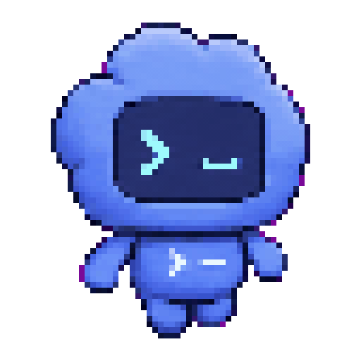
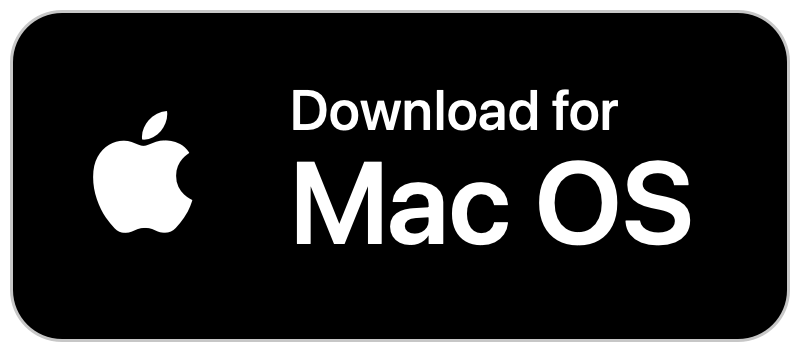

<p align="center">
  
</p>

<h1 align="center">Codex Status Bar</h1>

<p align="center">
  <em>A tiny macOS menu bar app for live Codex CLI status.</em>
</p>

<p align="center">
  
  <a href="./LICENSE"></a>
  
  
</p>

<p align="center">
  <sub><a href="./README.md">English</a> &middot; <a href="./README.ko.md">한국어</a></sub>
</p>

<p align="center">
  <a href="https://github.com/bytonylee/best-codex/releases/latest/download/CodexStatusBar.dmg"></a>
</p>

---

> *Codex Status Bar shows when Codex is thinking, running tools, waiting for permission, or done. No window. No dock icon. No dashboard. Just a live character in your macOS menu bar.*

Click the menu to choose a recent session, toggle the timer, switch animation
styles, and control sounds.

> Built for long Codex turns where you tab away and still want to know whether
> the agent is working, waiting on you, or finished.

**The app is a stateless poller — Codex hooks write state, the Swift app reads
it every 0.4s. It launches itself when Codex starts and self-quits when no
session is active. The only network call is a once-a-day GitHub release check.
Hook installation backs up `~/.codex/hooks.json` once before merging.**

## Why this exists

Codex can spend real time thinking, editing, running tools, or waiting for a
permission decision. The terminal is not always the active window, and checking
back manually breaks flow.

Codex Status Bar keeps that state visible in the macOS menu bar:

- active sessions animate
- permission waits become an amber indicator
- completed or inactive sessions rest as a still character
- recent sessions can be selected so the header follows the one you clicked
- the app quits itself when no Codex session is active

## Status

| State | Menu bar behavior | Notes |
|---|---|---|
| Thinking | Animated icon with optional timer | Starts on `UserPromptSubmit` |
| Running tool | Animated icon with short tool label | Uses friendly labels like `Editing` or `Running command` |
| Permission | Amber paused indicator | Triggered by Codex permission prompts |
| Done | Resting icon | Clears after you open the menu |
| Inactive selected session | Resting character only | No stale status text in the menu bar |

Menu controls:

- `Show timer` toggles the elapsed turn clock.
- `Play Sound` enables completion and permission sounds.
- `Recent` selects which active/recent session drives the header.
- `Animation` switches between Codex Character, Orbit, CLI, and Spark styles.
- `Color` switches programmatic styles between green and black-and-white.

## Install

Download the latest `CodexStatusBar.dmg` from
[Releases](https://github.com/tonylee/codex-status-bar/releases/latest), open
it, and drag **Codex Status Bar** into Applications.

Or build the app locally:

```bash
./build.sh
open -gj build/CodexStatusBar.app
```

On first launch, the app installs Codex hooks into `~/.codex/hooks.json` and
backs up the previous file once.

Requirements:

- macOS 12+
- Xcode or Swift command-line tools
- Node.js
- Codex CLI

Codex requires hooks to be trusted before they run. In interactive `codex`, you
will be prompted once. For `codex exec` automation, trust the hooks first or
pass Codex's hook-trust bypass flag when appropriate for your environment.

## How It Works

The app is a stateless poller.

Codex hooks write the current state to:

```text
~/.codex/statusbar/state.json
```

The Swift menu bar app polls that file every 0.4 seconds and renders the icon,
label, and optional timer. Active session markers are tracked under:

```text
~/.codex/statusbar/sessions.d/
```

Durable per-session status is stored separately under:

```text
~/.codex/statusbar/session-state/
```

Hook mapping:

| Codex event | Status bar state |
|---|---|
| `UserPromptSubmit` | `thinking` |
| `PreToolUse` | `tool` |
| `PostToolUse` | `thinking` |
| `Notification` permission prompt | `permission` |
| `PermissionRequest` | `permission` |
| `Stop` | `done` |
| `SessionStart` | launch app, register session |
| `SessionEnd` | unregister session, clear frozen state |

The only network call is a release check against GitHub.

## Build

Compile and bundle:

```bash
./build.sh
```

Create a DMG:

```bash
./build.sh --dmg
```

Focused compile check:

```bash
swiftc -O -target arm64-apple-macos12.0 Sources/*.swift -o /tmp/test -framework Cocoa
```

## Agent Skill

The local agent skill lives in `.agents/skills/character-animation-creator/`.
The `.claude/skills/character-animation-creator` entry is a symlink to the
same source, so Claude Code and other `.claude`-aware tools can use it without
duplicating files.

## For agents

One-time setup to build and launch the app:

```bash
cd /path/to/codex-status-bar
./build.sh
open -gj build/CodexStatusBar.app
```

After setup, start a Codex session and the menu bar icon appears
automatically. The app self-quits when no Codex session is active, so there is
nothing to manage by hand.

## Security

- The app is a stateless poller; it reads local state files and never sends
  Codex content anywhere.
- The only network call is a once-a-day GitHub release check.
- Hook installation backs up `~/.codex/hooks.json` once before merging.
- Hooks write only status state under `~/.codex/statusbar/`, never prompt
  content or transcripts.
- The app self-quits when no Codex session is active.
- Uninstall removes only the status-bar hooks, leaving the rest of
  `~/.codex/hooks.json` intact.

## Tests

```bash
# Swift contract tests
swiftc -O -target arm64-apple-macos12.0 Sources/*.swift tests/*Tests.swift -o /tmp/test -framework Cocoa

# Hook contract tests
node tests/hook-state-contract.test.js
node tests/hook-install-contract.test.js
node tests/hook-lifecycle-contract.test.js
```

The suite covers menu row layout, menu actions, header status policy, session
store reads, transcript resolution, icon renderer contracts, dashboard
contracts, world-cup animation contracts, and hook state/install/lifecycle
behavior.

## Uninstall

Remove only the status-bar hooks:

```bash
node "build/CodexStatusBar.app/Contents/Resources/uninstall.js"
```

Then quit the app and remove `build/CodexStatusBar.app` or the installed app
copy.

## Release

Current tag: [`v0.0.3`](https://github.com/bytonylee/best-codex/releases/tag/v0.0.3)

The `v0.0.3` release adds a styled DMG installer window with a custom
background (black curved arrow on a grainy white background) guiding the user
to drag the app icon into the Applications folder, matching the mac-whisper
installer layout (660x440 window, 80px icons).

## Acknowledgements

Codex Status Bar builds on the ideas and code of an excellent open-source
project:

- [claude-status-bar](https://github.com/m1ckc3s/claude-status-bar) (MIT) — the macOS menu bar app pattern for surfacing Claude Code's live status; the stateless poller design, hook-driven state model, and multi-session menu bar behavior follow the pattern this project established.

We thank the authors and maintainers of this project.

## License

[MIT](./LICENSE)
